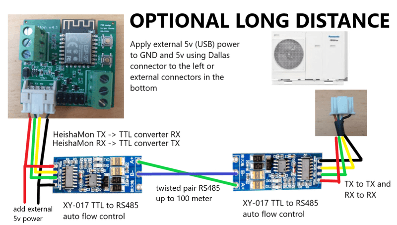

[](https://join.slack.com/t/panasonic-wemos/shared_invite/enQtODg2MDY0NjE1OTI3LTgzYjkwMzIwNTAwZTMyYzgwNDQ1Y2QxYjkwODg3NjMyN2MyM2ViMDM3Yjc3OGE3MGRiY2FkYzI4MzZiZDVkNGE)


# Panasonic H, J, K & L Series Aquarea air-water heat pump protocol

This project makes it possible to read information from Panasonic Aquarea heat pump and report the data either to an MQTT server or as JSON format over HTTP.

Eine deutschsprachige [README_DE.md](README_DE.md) findest du hier. \
Een nederlandse vertaling [README_NL.md](README_NL.md) vind je hier. \
Suomen kielellä [README_FI.md](README_FI.md) luettavissa täällä.

*Help on translation to other languages is welcome.*

# Current releases
Current release is version 3.5. The ESP8266 compiled binary can be installed on a Wemos D1 mini, on the HeishaMon PCB and generally on any ESP8266 based board compatible with Wemos build settings (at least 4MB flash). You can also download the code and compile it yourself (see required libraries below). The ESP32-S3 binary is for the newer, large, version of heishamon.


# Using the software
HeishaMon is able to communicate with the Panasonic Aquarea H, J, K and L&series. [Confirmed by users types of HP you can find here](HeatPumpType.md) \
If you want to compile this image yourself be sure to use the mentioned libraries and support for a filesystem on the esp8266 so select the correct flash option in arduino ide for that.

When starting, without a configured wifi, an open-wifi-hotspot will be visible allowing you to configure your wifi network and your MQTT server. Configuration page will be located at http://192.168.4.1 . \

After configuring and booting the image will be able to read and talk to your heatpump. The GPIO13/GPIO15 connection will be used for communications so you can keep your computer/uploader connected to the board if you want. \
Serial 1 (GPIO2) can be used to connect another serial line (GND and TX from the board only) to read some debugging data.

All received data will be sent to different MQTT topics (see below for topic descriptions). There is also a 'panasonic_heat_pump/log' MQTT topic which provides debug logging and a hexdump of the received packets (if enabled in the web portal).

You can connect a 1wire network on GPIO4 which will report in seperate MQTT topics (panasonic_heat_pump/1wire/sensorid).

The software is also able to measure Watt on a S0 port of two kWh meters. You only need to connect GPIO12 and GND to the S0 of one kWh meter and if you need a second kWh meter use GPIO14 and GND. It will report on MQTT topic panasonic_heat_pump/s0/Watt/1 and panasonic_heat_pump/s0/Watt/2 and also in the JSON output. You can replace 'Watt' in the previous topic with 'Watthour' to get consumption counter in WattHour (per mqtt message) or to 'WatthourTotal' to get the total consumption measured in WattHour. To sync the WatthourTotal with your kWh-meter, publish the correct value to MQTT to the panasonic_heat_pump/s0/WatthourTotal/1 or panasonic_heat_pump/s0/WatthourTotal/2 topic with the 'retain' option while heishamon is rebooting. Upon reboot, heishamon reads this value as the last known value to you can sync using this method.

Updating the firmware is as easy as going to the firmware menu and, after authentication with username 'admin' and password 'heisha' (or other provided during setup), uploading the binary there.

A json output of all received data (heatpump and 1wire) is available at the url http://heishamon.local/json (replace heishamon.local with the ip address of your heishamon device if MDNS is not working for you).

Within the 'integrations' folder you can find examples how to connect your automation platform to the HeishaMon.

# Rules functionality
The rules functionality allows you to control the heatpump from within the HeishaMon itself. Which makes it much more reliable then having to deal with external domotica over WiFi. When posting a new ruleset, it is immidiatly validated and when valid used. When a new ruleset is invalid it will be ignored and the old ruleset will be loaded again. You can check the console for feedback on this. If somehow a new valid ruleset crashes the HeishaMon, it will be automatically disabled the next reboot, allowing you to make changes. This prevents the HeishaMon getting into a boot loop.

The techniques used in the rule library allows you to work with very large rulesets, but best practice is to keep it below 10.000 bytes.

Notice that sending commands to the heatpump is done asynced. So, commands sent to the heatpump at the beginning of your syntax will not immediatly be reflected in the values from the heatpump later on. Therefor, heatpump values should be read from the heatpump itself instead of those based on the values you keep yourself.

## Syntax
Two general rules are that spaces are mandatory and semicolons are used as end-of-line character.

### Variables
The ruleset uses the following variable structure:

- `#`: Globals
These variables can be accessed throughout the ruleset but have to defined inside a rule block. Don't use globals for all your variables, because it will persistently use memory.

- `$`: Locals
These variables live inside a rule block. When a rule block finishes, these variables will be cleaned up, freeing any memory used.

- `@`: Heatpump parameters
These are the same as listed in the Manage Topics documentation page and as found on the HeishaMon homepage. The ruleset also follows the R/W logic as used through the MQTT and REST API. That means that the read topics differ from the write topics. So reading the heatpump state is done through `@Heatpump_State`, changing the heatpump state through `@SetHeatpump`.

- `%`: Datetime variables
These can be used for date and time based rules. Currently `%hour` (0 - 23), `%minute` (0 - 59), `%month` (1 - 12), and `day` (1 - 7)  are supported. All are plain integers. A proper NTP configuration is needed to set the correct system date and time on the HeishaMon.

- `?`: Thermostat parameters
These variables reflect parameters read from the connected thermostat when using the OpenTherm functionality. When OpenTherm is supported this documentation will be extended with more precise information. The can check the opentherm tab for the variables that can be used. The names are the same for reading and writing, but not all values support reading and/or writing. The opentherm tab also lists this.

- `ds18b20#2800000000000000`: Dallas 1-wire temperature values
Use these variables to read the temperature of the connected sensors. These values are of course readonly. The id of the sensor should be placed after the hashtag.

When a variable is called but not yet set to a value, the value will be `NULL`.

Variables can be of boolean (`1` or `0`), float (`3.14`), integer (`10`), and string type. Defining strings is done with single or double quotes.

### Events or functions
Rules are written in `event` or `function` blocks. These are blocks that are triggered when something happened; either a new heatpump or thermostat value has been received or a timer fired. Or can be used as plain functions

```
on [event] then
  [...]
end

on [name] then
  [...]
end
```

Events can be Heatpump or thermostat parameters or timers:
```
on @Heatpump_State then
  [...]
end

on ?setpoint then
  [...]
end

on timer=1 then
  [...]
end
```

When defining functions, you just name your block and then you can call it from anywhere else:
```
on foobar then
  [...]
end

on @Heatpump_State then
  foobar();
end
```

Functions can have parameters which you can call:
```
on foobar($a, $b, $c) then
  [...]

on @Heatpump_State then
  foobar(1, 2, 3);
end
```

If you call a function less values then the function takes, all other parameters will have a NULL value.

There is currently one special function that calls when the system is booted on when a new ruleset is saved:
```
on System#Boot then
  [...]
end
```

This special function can be used to initially set your globals or certain timers.

### Operators
Regular operators are supported with their standard associativity and precedence. This allows you to also use regular math.
- `&&`: And
- `||`: Or
- `==`: Equals`
- `>=`: Greater or equal then
- `>`: Greater then
- `<`: Lesser then
- `<=`: Lesser or equal then
- `-`: Minus
- `%`: Modulus
- `*`: Multiply
- `/`: Divide
- `+`: Plus
- `^`: Power

Parenthesis can be used to prioritize operators as it would work in regular math.

### Functions
- `coalesce`
Returns the first value not `NULL`. E.g., `$b = NULL; $a = coalesce($b, 1);` will return 1. This function accepts an unlimited number of arguments.

- `max`
Returns the maximum value of the input parameters.

- `min`
Returns the minimum value of the input parameters.

- `isset`
Return boolean true when the input variable is still `NULL` in any other cases it will return false.

- `round`
Rounds the input float to the nearest integer.

- `floor`
The largest integer value less than or equal to the input float.

- `ceil`
The smallest integer value greater than or equal to the input float.

- `setTimer`
Sets a timer to trigger in X seconds. The first parameter is the timer number and the second parameters the number of seconds before it fires. A timer only fires once so it has to be re-set for recurring events. When a timer triggers it will can the timer event as described above. E.g.

- `print`
Prints a value to the console.

```
on System#Boot then
  setTimer(3, 60);
end

on timer=3 then
  [...]
  setTimer(3, 60);
end
```

### Conditions
The only supported conditions are `if`, `else`, and `elseif`:

```
if [condition] then
  [...]
else
  if [condition] then
    [...]
  end
end
```

```
if [condition] then
  [...]
elseif [condition] then
  if [condition] then
    [...]
  else
    [...]
  end
elseif [condition] then
  [...]
else
  [...]
end
```

### Examples
Once the rules system is in used by more and more users, additional examples will be added to the documentation.

*Calculating WAR*
```
on calcWar($Ta1, $Tb1, $Ta2, $Tb2) then
	#maxTa = $Ta1;

	if @Outside_Temp >= $Tb1 then
		#maxTa = $Ta1;
	elseif @Outside_Temp <= $Tb2 then
		#maxTa = $Ta2;
	else
		#maxTa = $Ta1 + (($Tb1 - @Outside_Temp) * ($Ta2 - $Ta1) / ($Tb1 - $Tb2));
	end
end
```

*Thermostat setpoint*
```
on ?roomTemp then
	calcWar(32, 14, 41, -4);

	$margin = 0.25;

	if ?roomTemp > (?roomTempSet + $margin) then
		if @Heatpump_State == 1 then
			@SetHeatpump = 0;
		end
	elseif ?roomTemp < (?roomTempSet - $margin) then
		if @Heatpump_State == 0 then
			@SetHeatpump = 1;
		end
	else
		@SetZ1HeatRequestTemperature = round(#maxTa);
	end
end
```

# Factory reset
A factory reset can be performed on the web interface but if the web interface is unavailable you can perform a double reset. The double reset should be performed not too fast but also not too slow. Usually halve a second between both resets should do the trick. To indicate that the double reset performed a factory reset, the blue led will flash rapidly (You need to press reset again now to restart HeishaMon back to normal where a WiFi hotspot should be visible again).

# Further information
Below you can find some technical details about the project. How to build your own cables. How to build your own PCB etc.

## Connection details:
Communication can be established thru one of the two sockets: CN-CNT or CN-NMODE. If you have an existing Panasonic CZ-TAW1 WiFi interface that you want to replace with HeishaMon, it is only a matter of plugging the cable out from CZ-TAW1 and reconnecting to your HeishaMon device. However it is not possible to use HeishaMon and the original CZ-TAW1 module together as an active device. It is however possible to put HeishaMon on "Listen Only" mode which will allow HeishaMon and the original CZ-TAW1 module to co-exist. The only downside to this is that HeishaMon is unable to send commands and use the optional PCB option.

Communication parameters: TTL 5V UART 9600,8,E,1  \
 \
CN-CNT Pin-out (from top to bottom) \
1 - +5V (250mA)  \
2 - 0-5V TX (from heatpump) \
3 - 0-5V RX (to heatpump)\
4 - +12V (250mA) \
5 - GND \
 \
CN-NMODE Pin-out (from left to right) \
"Warning! As printed on the PCB, the left pin is pin 4 and right pin is pin 1. Do not count 1 to 4 from left!  \
4 - +5V (250mA)  \
3 - 0-5V TX (from heatpump) \
2 - 0-5V RX (to heatpump) \
1 - GND

HeishaMon will receive power from the Panasonic over the cable (5v power).

## Long distance connection
It it possible to connect the HeishaMon over a long distance. Up to 5 meter is working with normal cabling. For longer distances a TTL-to-RS485 configuration as show in the picture below is possible. The however requires HeishaMon to be powered externally using 5v power (for example from an USB cable).




## Where to get connectors
[RS-Online orders](Connectors_RSO.md)

[Conrad orders](Connectors_Conrad.md)

Use some 24 AWG shielded 4-conductors cable.


## The HeishaMon hardware itself
The PCB's needed to connect to the heatpump are designed by project members and are listed below. The most important part of the hardware is a level shifting between 5v from the Panasonic to 3.3v of the HeishaMon and a GPIO13/GPIO15 enable line after boot. \
[PCD Designs from the project members](PCB_Designs.md) \
[Picture Wemos D1 beta](WEMOSD1.JPG) \
[Picture ESP12-F](NewHeishamon.JPG)

To make things easy you can order a completed PCB from some project members: \
[Tindie shop](https://www.tindie.com/stores/thehognl/) from Igor Ybema (aka TheHogNL) based in the Netherlands

## Building the arduino image yourself
boards: \
esp8266 by esp8266 community version 3.0.2 [Arduino](https://github.com/esp8266/Arduino/releases/tag/3.0.2)

All the [libs we use](LIBSUSED.md) necessary for compiling.


## MQTT topics
[Current list of documented MQTT topics can be found here](MQTT-Topics.md)

## DS18b20 1-wire support
The software also supports ds18b20 1-wire temperature sensors reading. A proper 1-wire configuration (with 4.7kohm pull-up resistor) connected to GPIO4 will be read each configured secs (minimal 5) and send at the panasonic_heat_pump/1wire/"sensor-hex-address" topic. On the pre-made boards this 4.7kohm resistor is already installed.

## Large board relay control
The newer, large, heishamon contains two onboard relays which can be switched on and off using MQTT commands. The relays can be used for any contact switching, even 230V mains (max 5A). For example to switch the 230V contacts in the heatpump for controlling the 'external thermostat', switching a pump on or off or other lower power devices. I do not recommend to use the relay as a switch for a electric heater as they use too much power. To control the relay just send a value of 1 or 0 to the MQTT topic "panasonic_heat_pump/gpio/relay/one" for relay one or "panasonic_heat_pump/gpio/relay/two" for relay two.

## Opentherm support
If your heishamon board supports opentherm the software can also be used to bridge opentherm information from a compatible thermostat to your home automation over MQTT or JSON and as mentioned above it can also be connected directly in the rules to connect opentherm information to the heatpump and back, for example to display the outside temperature from the heatpump on your opentherm thermostat. If you enable opentherm support in settings there will be a new tab visible in the web page. On that tab you will see opentherm values. Some are of type R(ead) and some are W(rite), and some are both. Read means that the thermostat can read that information from the heishamon. You provide that information over MQTT (or using the rules) by updating this value on the mqtt 'opentherm/read' topic, for example 'panasonic_heat_pump/opentherm/read/outsideTemp'. The write values are information from the thermostat, like 'roomTemp'. These are available on mqtt topic 'opentherm/write'. You can use these values to change the heatpump behaviour in anyway you want using your home automation and mqtt set-commands to heishamon on using the internal rules.

The available opentherm variables are: 
### WRITE values
- chEnable which is a boolean showing if central heating shoud be enabled. This is often used when the thermostat wants to heat up your house. 
- dhwEnable which is a boolean showing if the dhw heating should be enabled. Often used as a user option on the thermostat to disable DHW heating during vacation
- coolingEnable which is a boolean showing if  cooling should be enabled. Amount of cooling is request in 'coolingControl', see below.
- roomTemp is the floating point value of the measured room temp by thermostat
- roomTempSet is the floating point value of the requested room temp setpoint on the thermostat
- chSetpoint is the floating point value of the calculated water setpoint by thermostat. Opentherm thermostats try to set this chSetpoint to not overshoot the room setpoint. Could be used to set the water setpoint on the heatpump but most thermostats are too fast responding compared to how heatpumps work
- maxRelativeModulation is the amount of modulation (0-100%) the heatpump (opentherm slave) is allowed to use (see relativeModulation in READ values, which should always be equal or lower than this max)
- coolingControl is the amount of cooling (0-100%) the thermostat requests from the heatpump. Requires an opentherm thermostat with cooling support.
### READ AND WRITE values
- dhwSetpoint is the floating point value which is the current DHW setpoint by thermostat, but can also be set by heishamon to override it. Not all thermostat support this though. It should not be set higher than dhwSetUppBound, see below.
- maxTSet is the floating point value which defines the maximum water setpoint. The user can set this on the thermostat or can also set from heishamon. It should not be set higher than chSetUppBound, see below.
### READ values
- chPressure is the floating point value which defines measured water pressure of central heating provided by heishamon
- outsideTemp is the floating point value which defines measured outside temperature of central heating provided by heishamon
- inletTemp is the floating point value which defines measured water inlet temperature of central heating provided by heishamon
- outletTemp is the floating point value which defines measured water outlet temperature of central heating provided by heishamon
- dhwTemp is the floating point value which defines measured dhw temperature of central heating provided by heishamon
- relativeModulation is the amount (0-100%) of modulation the heatpump (opentherm slave) is currently running on, should always be lower or equal than the maxRelativeModulation set by the thermostat
- flameState is a boolean value (send 'true', 'on' or '1' to enable) which defines if the central heating is providing heat central
- chState is a boolean value (send 'true', 'on' or '1' to enable) which defines if the heatpump is on room/central heating mode (for example 3-way valve on room, in heating mode)
- dhwState is a boolean value (send 'true', 'on' or '1' to enable) which defines if the heatpump is on DHW mode (for example 3-way valve on dhw)
- coolingState is a boolean value (send 'true', 'on' or '1' to enable) which defines if the heatpump is on room/central cooling mode (for example 3-way valve on room, in cooling mode)
- dhwSetUppBound is a integer value from 0 to 127 which sets the max DHW temperature supported so the thermostat can not request a dhwSetpoint higher than this. Default is set to 75. To override, send a MQTT message to this topic and make it retained so heishamon receives it again after reboot.
- dhwSetLowBound is a integer value from 0 to 127 which sets the min DHW temperature supported so the thermostat can not request a dhwSetpoint lower than this. Default is set to 40. To override, send a MQTT message to this topic and make it retained so heishamon receives it again after reboot.
- chSetUppBound is a integer value from 0 to 127 which sets the max CH (heating water) temperature supported so the thermostat can not request a chSetpoint higher than this. Default is set to 65. To override, send a MQTT message to this topic and make it retained so heishamon receives it again after reboot.
- chSetLowBound is a integer value from 0 to 127 which sets the min CH (heating water) temperature supported so the thermostat can not request a chSetpoint lower than this. Default is set to 20. To override, send a MQTT message to this topic and make it retained so heishamon receives it again after reboot.

## Protocol byte decrypt info:
[Current list of documented bytes decrypted can be found here](ProtocolByteDecrypt.md)


## Integration Examples for Opensource automation systems
[Openhab2](Integrations/Openhab2)

[Home Assistant](Integrations/Home%20Assistant)

[IOBroker Manual](Integrations/ioBroker_manual)

[Domoticz](Integrations/Domoticz)


